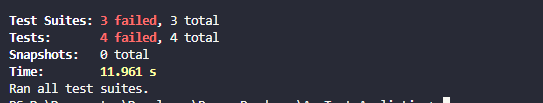
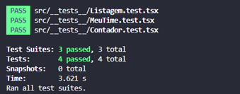

# Exame de recrutamento (React Native)
[](https://www.prodemge.gov.br/)

## Tempo Máximo de Exame ⏲️

Prazo de 60 minutos para comitar a solução dos testes.

## Sobre o exame ℹ️

Nesse desafio, você receberá um aplicativo com alguns erros em seus componentes, a sua tarefa consiste em corrigi-los.

Não existe pontuação, o exame é utilizado somente para medir seu conhecimento, portanto é **recomendado** que consultas externas não sejam feitas, garantindo assim uma maior transparência acerca de seu conhecimento.

## Configuração local para exame prático 💻

<details>
  <summary>Pré-requisitos</summary>

- Conta no Github - Acesse o [link](https://github.com/) para entrar em sua conta ou se cadastrar.

- Git instalado - Acesse o [link](https://git-scm.com/downloads) para realizar o download do executável conforme seu sistema operacional. Não é necessário mudar nenhuma configuração na instalação, apenas seguir os passos (next) até a finalização da instalação.

- Node.js instalado - Acesse o [link](https://nodejs.org/pt-br/download) para realizar o download.

</details>

<details>
  <summary>Clonando e rodando os testes 🔴 IMPORTANTE 🔴</summary>

1. **Clonar o repositório:** Para iniciar o exame você deve clonar este repositório ```git clone https://github.com/prodemge-mg/exame-recrutamento-rn.git```
2. **Instalar as dependências:** Dentro da raiz do projeto, você irá rodar o seguinte comando: ```npm install```
3. **Rodando os testes:**  Dentro da raiz do projeto, você irá rodar o seguinte comando: ```npm run test```

No seu console deve aparecer ás seguintes informações:



</details>


## Exame 📝

Existem três componentes na aplicação: ```Contador, MeuTime e Listagem```. Os três componentes possuem erros de lógica. Em cada teste, tem uma breve descrição no que sua aplicação deve cumprir para que o teste passe

-	Contador 
    -	Deve ser possível que a contagem funcione corretamente
        -	Para que esse teste passe, o componente deve fazer a contagem corretamente

-	MeuTime
    -	Deve ser possível mostrar o nome do time corretamente
        -	Para que esse teste passe, o componente deve exibir em tela o nome do time que é passado no atributo do componente
    -	Deve ser possível alterar o nome do time
        -	Para que esse teste passe, o componente deve exibir em tela o nome do time que foi alterado através do input

-	Listagem
    -	Deve ser possível listar todos os itens
        -	Para que esse teste passe, o componente deve exibir em tela todos os itens recebidos no parâmetro


**Observação:** Para que os testes funcionem corretamente é necessário que **altere somente os componentes** ```[Contador.tsx, MeuTime.tsx, Listagem.tsx]```, dito isso, faça as alterações que achar necessário dentro dos componentes


## Fiz todas as correções, e agora?

Se tudo deu certo, o seu console deve retornar essas informações após rodar o comando npm run test



Ao finalizar suba o código para seu repositório no GitHub e avise ao responsável.
